# 1. Introduction

[Emby](https://emby.media) is a media server designed to organize, play, and stream audio and video to a variety of devices


# 2. URL

 - To access Emby, visit https://emby._yourdomain.com_

# 3. Initial Setup

## i. Domain

- See [Adding a Subdomain](../reference/subdomain.md) on how to add the subdomain `emby` to your DNS provider.

- _Note: You can skip this step if you are using [Cloudflare](../reference/domain.md#cloudflare) with Saltbox._

## ii. Install

  - Run the following command:

    ```bash
    sb install emby  
    ```

# 4. Setup Wizard

1. Visit https://emby._yourdomain.com_.


1. Select your **preferred display language**. Click **Next**.

   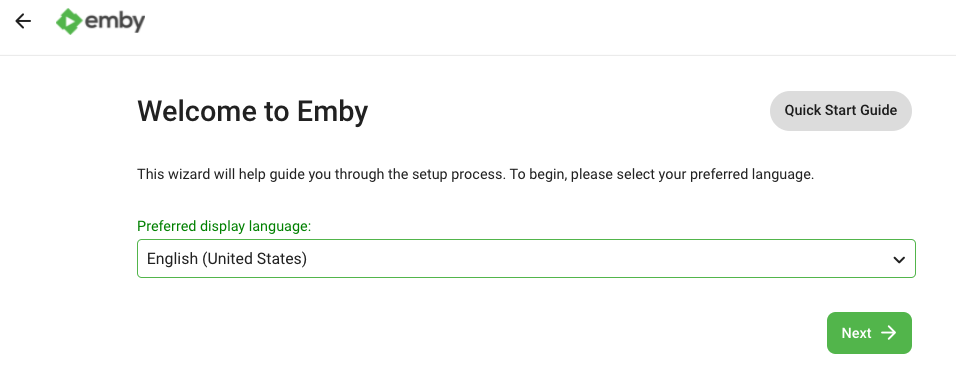)

1. **Type** the following and click **Next**:

    - **Username:** _The username you wwant to use to log into Emby_ 
   
    - **New Password:** _A strong password you'll use to log into Emby_ 

    - **New Password Confirm:** _That same password again_ 

    - **Emby connect username or email address**: _your [Emby Connect username](https://emby.media/connect)_ (important)

   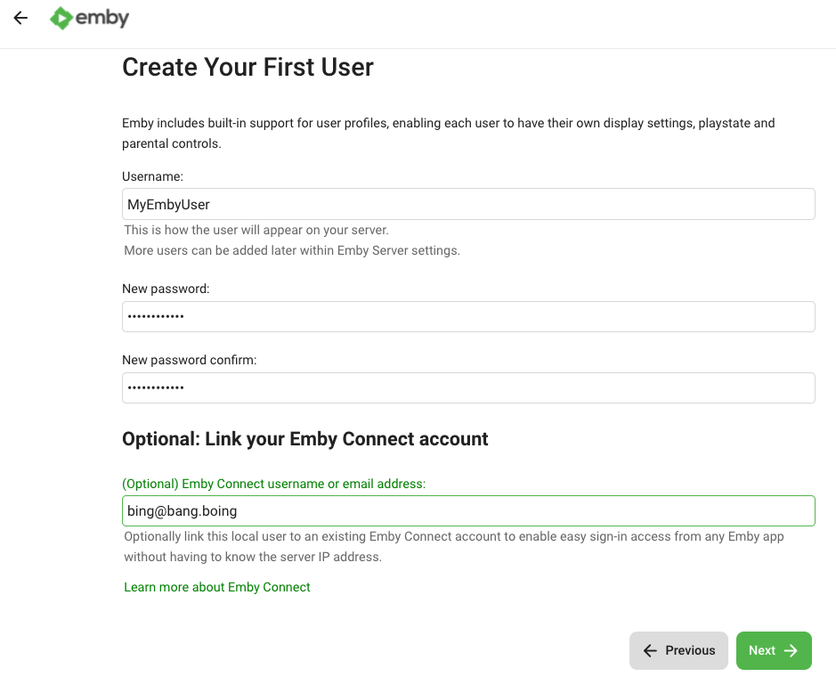

1. Confirm the message by clicking **Got It**.

   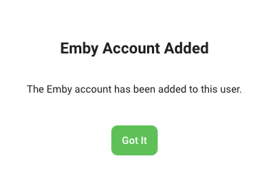
   
1. **Confirm** the link in your email. 

   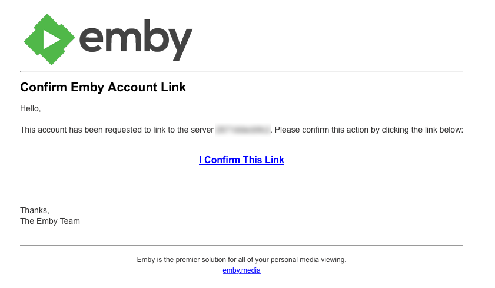

   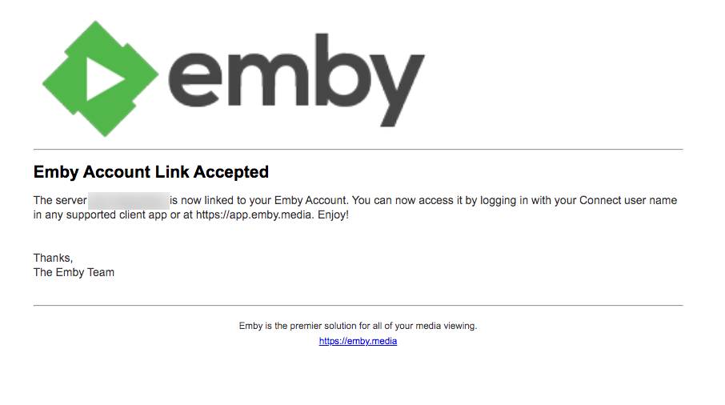

2. Skip the adding of the libraries. Click **Next**.

   

3. Select your **Preferred Metadata Language** and **Country** (_`English` and `United States` are recommended_) and click **Next**.

   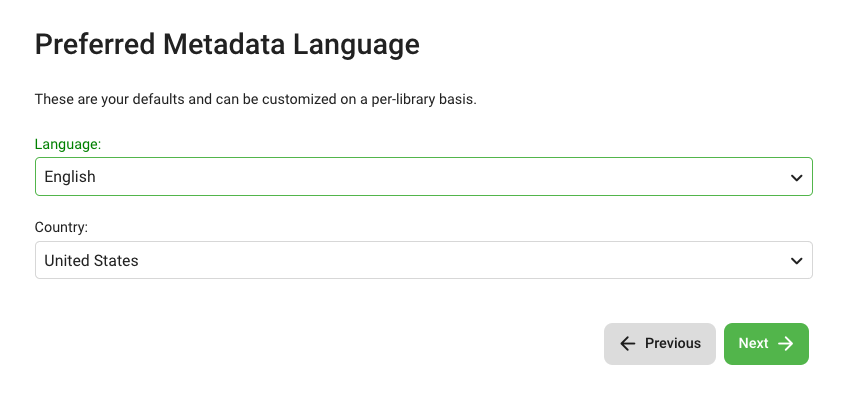


4. Uncheck **Enable automatic port mapping**. Click **Next**.

   

5. **Check** to accept the terms. Click **Next**.

   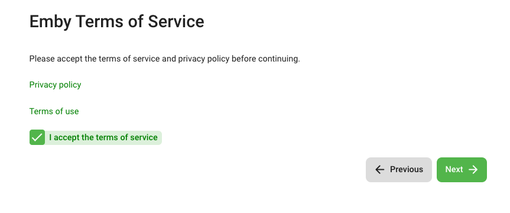

6. Click **Finish**.

   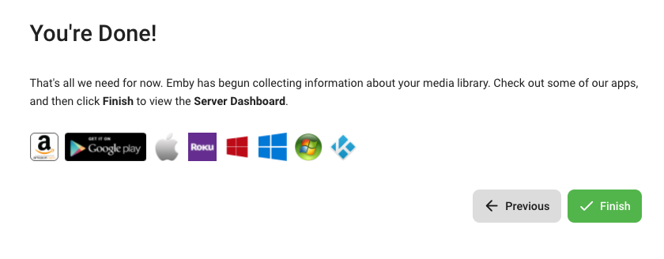

7. You will now be taken to the **Dashboard** view.


# 5. Settings

## i. Transcoding

1. Go to **Settings**.

1. Go to **Transcoding**.

   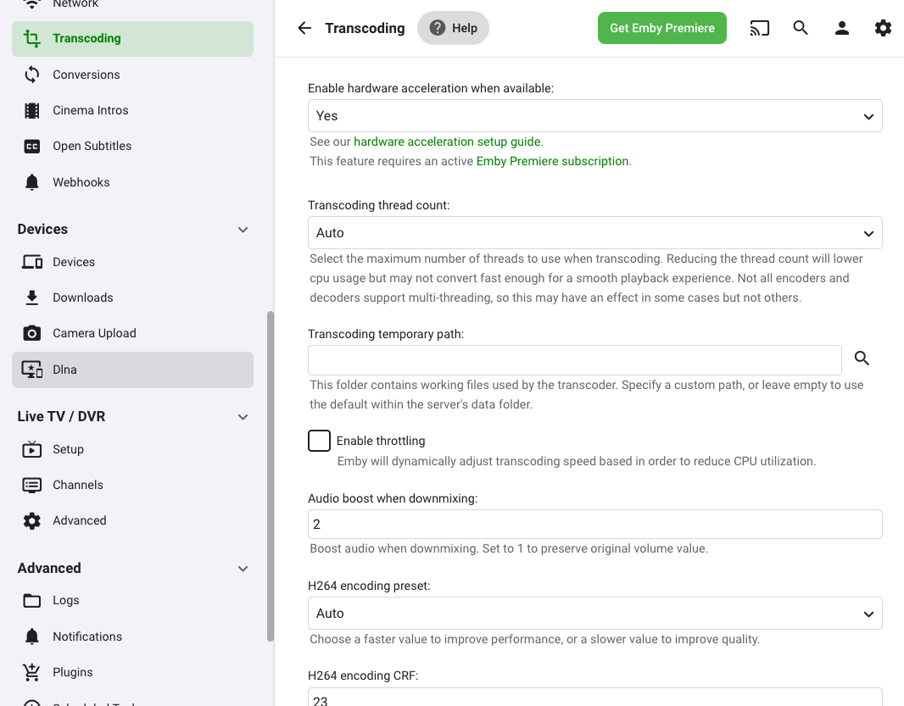

1. Under **Enable hardware acceleration when available**, select **Advanced**.

   

2. Under **Transcoding temporary path**, type in or choose `/transcode`.

   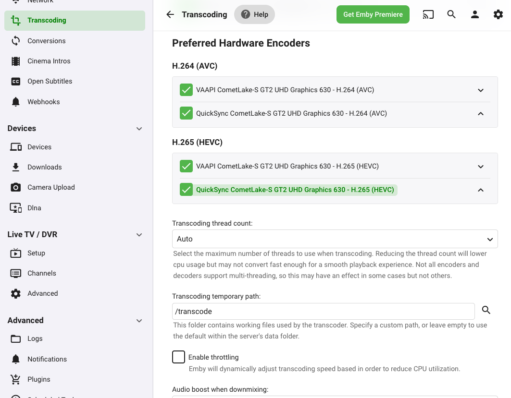

3. Click **Save**.


## iii. Libraries

In this section, we will add two libraries: one for Movies and one for TV Shows.

### Add Movie Library

1. Go to **Settings**.

1. Go to **Library**.

   

1. Click **+ New Library**.

1. Under **Content type**, select **Movies**. 

   

   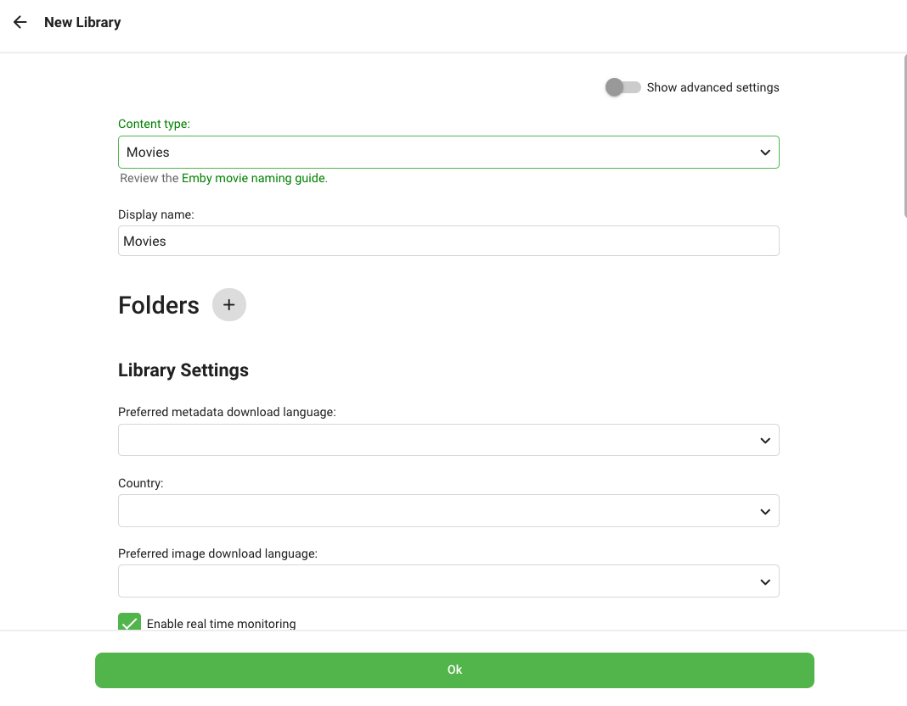

1. Click **+** next to **Folders**.

1. Type in or choose `/mnt/unionfs/Media/Movies`. Click **OK**.

   _Note: These [paths](../saltbox/basics/paths.md) are for the standard library setup. If you have [customized](../reference/customizing-plex-libs.md) it, use those paths instead._

   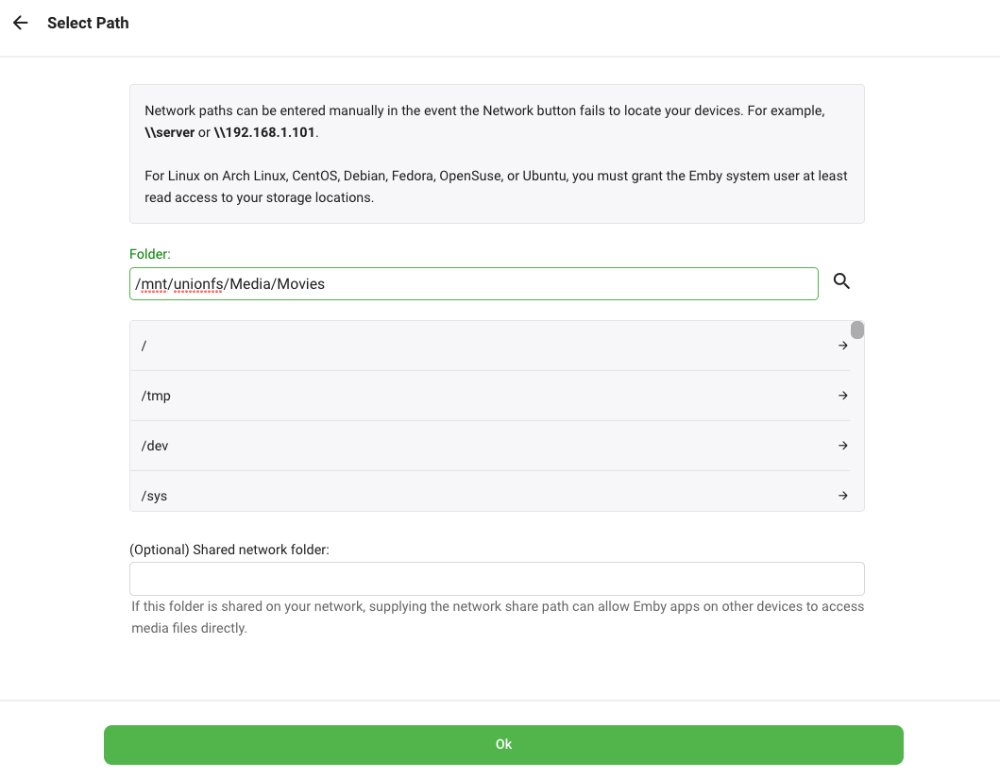

2. Click **OK** once more.

### Add TV Shows Library

1. Go to **Settings**.

1. Go to **Library**.

   

1. Click **+ New Library**.

1. Under **Content type**, select **TV shows**. 

   

   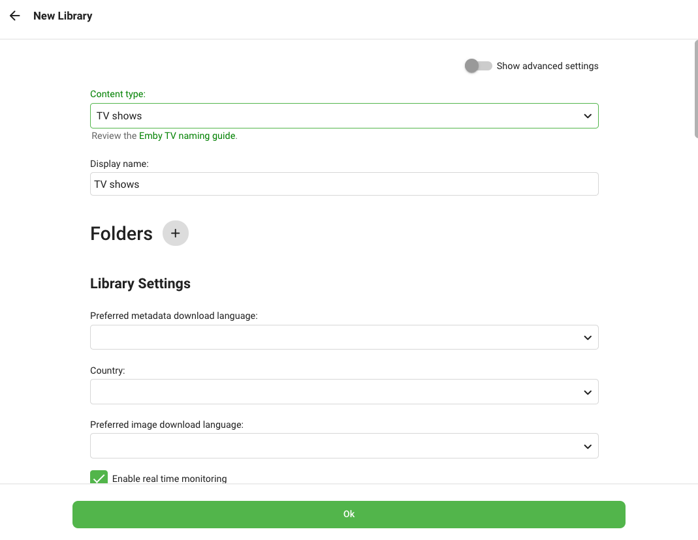

1. Click **+** next to **Folders**.

1. Type in or choose `/mnt/unionfs/Media/TV`. Click **OK**.

   _Note: These [paths](../saltbox/basics/paths.md) are for the standard library setup. If you have [customized](../reference/customizing-plex-libs.md) it, use those paths instead._

   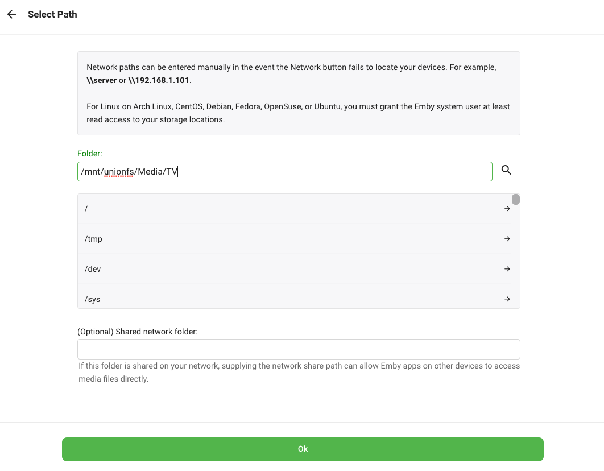

2. Click **OK** once more.


# 6. API Key

Instructions below will guide you through creating an API Key for a specific app.

1. Click the **Settings** icon.

2. Under **Advanced**, click **API Keys**.

   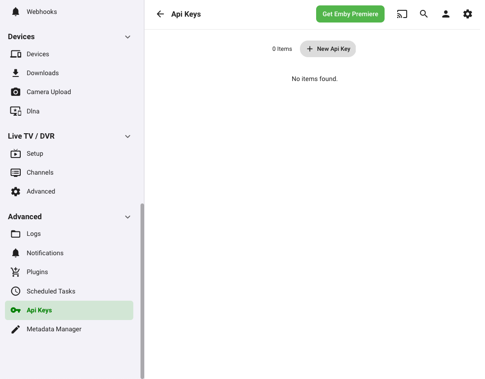

3. Click **+ New API Key**. 

   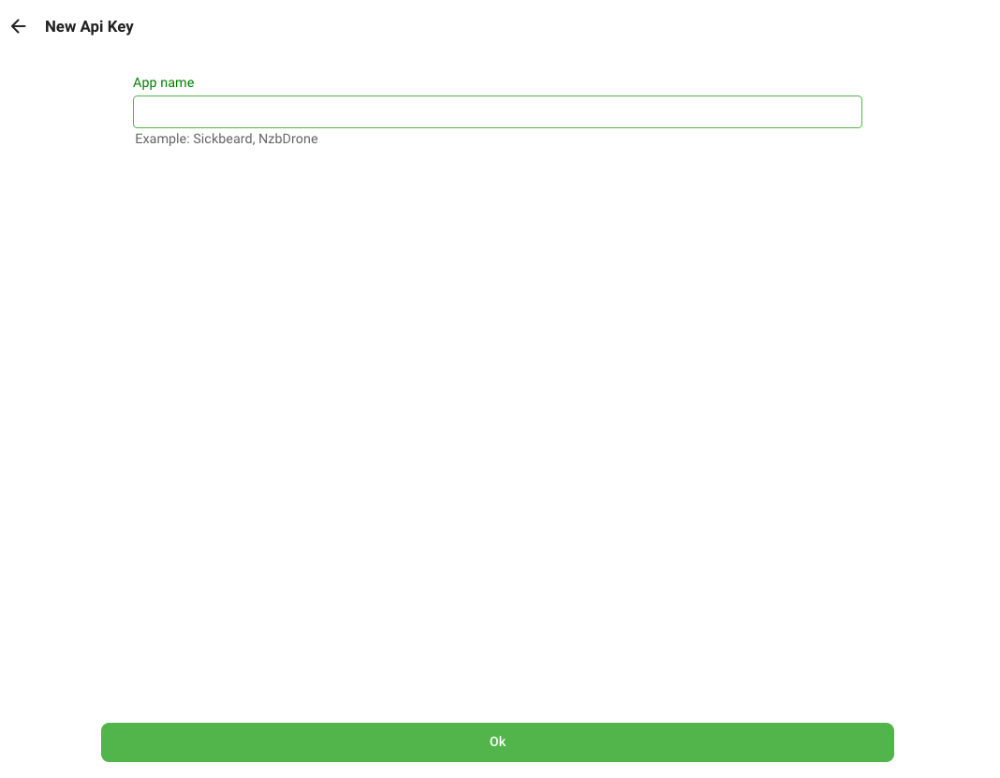

4. Fill in an **App name** (e.g. Ombi) and click **OK**.

5. You have now have created an **Api Key** for your app.

   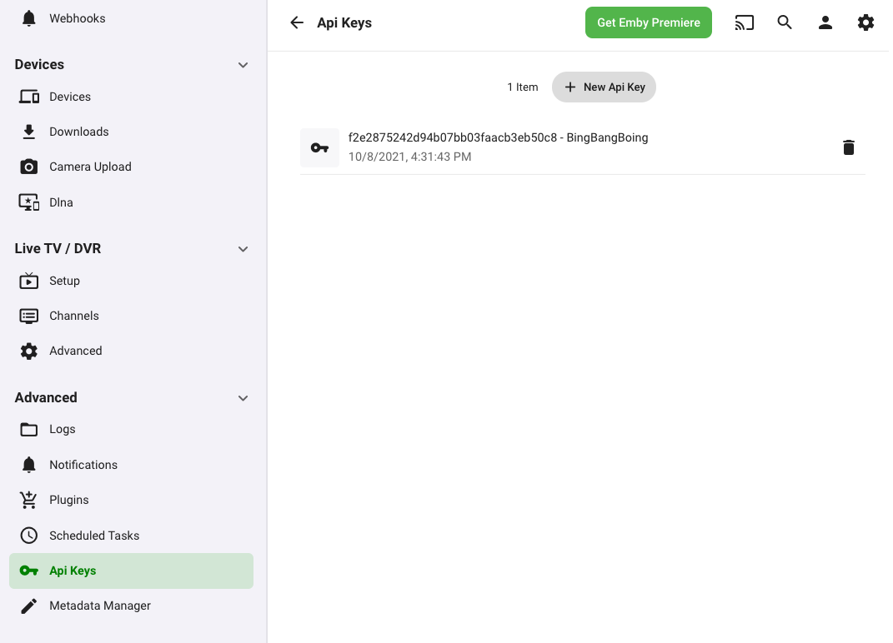

