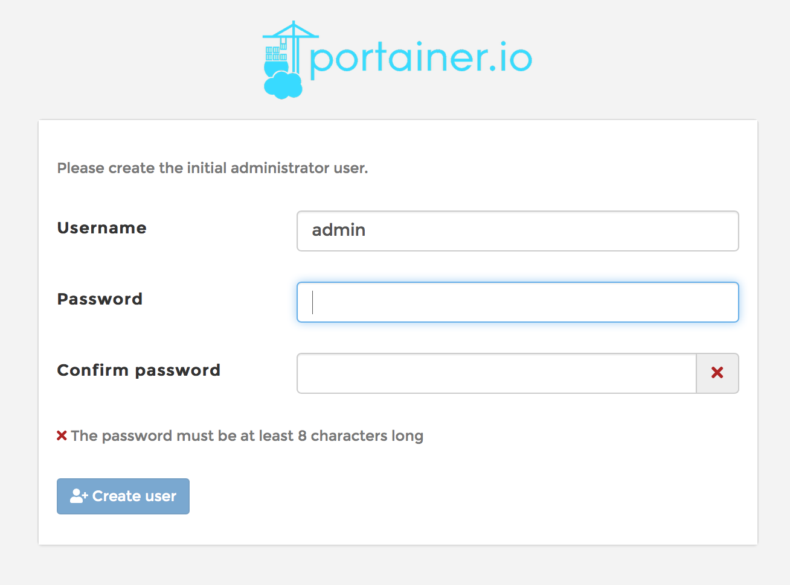
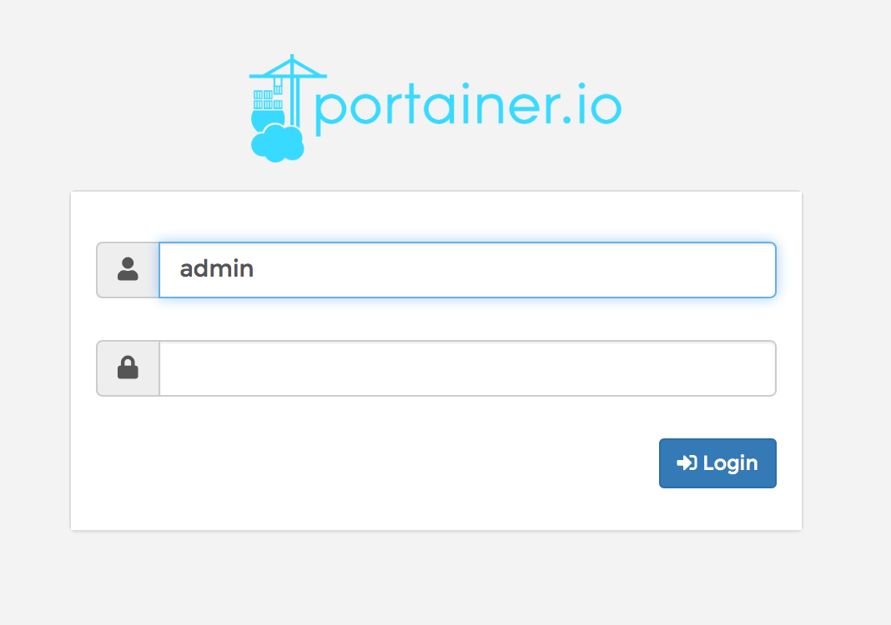
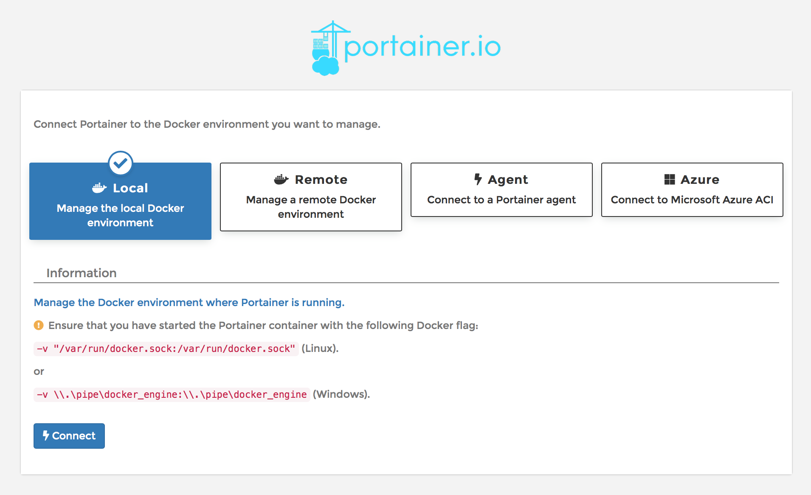

THIS PAGE HAS NOT BEEN FULLY UPDATED FOR SALTBOX

## What is it?

[Portainer](https://portainer.io/) is an open-source lightweight management UI which allows you to easily manage your Docker containers, images, networks and volumes.

| Details     |             |             |             |
|-------------|-------------|-------------|-------------|
| [:material-home: Project home ](https://portainer.io/){: .header-icons target=_blank rel="noopener noreferrer" } | [:octicons-link-16: Docs](https://docs.portainer.io//){: .header-icons target=_blank rel="noopener noreferrer" } | [:octicons-mark-github-16: Github:](https://github.com/portainer/portainer/){: .header-icons target=_blank rel="noopener noreferrer" } | [:material-docker: Docker ](https://hub.docker.com/r/portainer/portainer-ce){: .header-icons target=_blank rel="noopener noreferrer" }|

## 2. URL

To access Portainer, visit  https://portainer._yourdomain.com_

## 3. Initial Setup

1. The first time you go to the Portainer page, you will be presented with the message "Please create the initial administrator user.". Fill in your preferred admin username and password. Click `Create User`.

    

2. On this first visit when you set up the admin user, you will be logged in automagically. On future visits, you will be asked to log in with your username and password.

    

3. On the "Connect Portainer to the Docker environment you want to manage." screen, select `Local: Manage the local Docker environment` and click `Connect`.

    _Note: Don't be confused by "local" in this context.  It is referring to the relationship between the Docker instance you're managing [on your Cloudbox] and this instance of Portainer [also on your Cloudbox].  These things are local to each other on your Cloudbox server, wherever that is.  They may be remote from you, but they are local to each other.  Pay no mind to what looks like a warning at the bottom.  Cloudbox has already taken care of that._

    

4. Portainer is now setup.