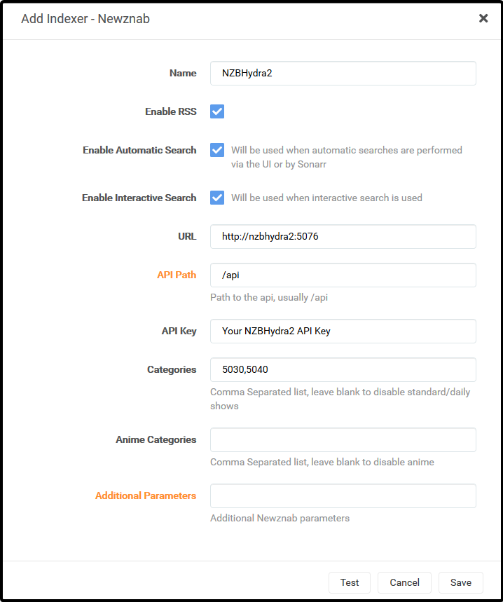
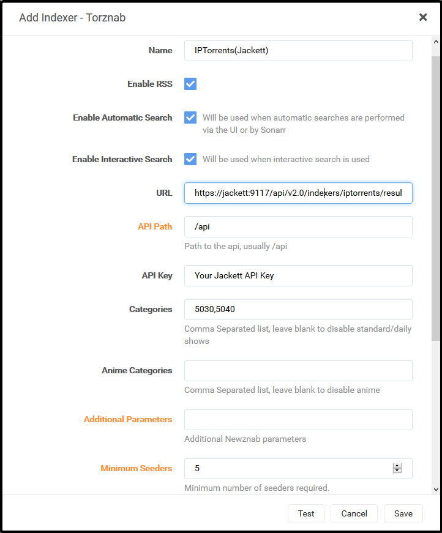
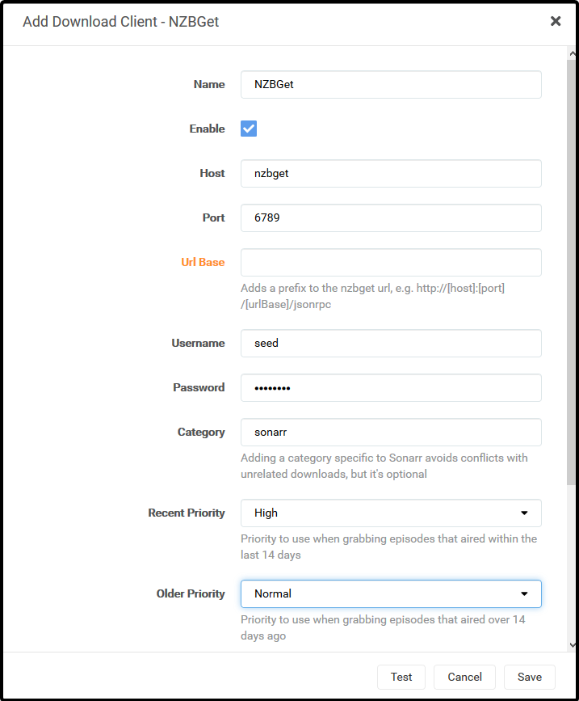
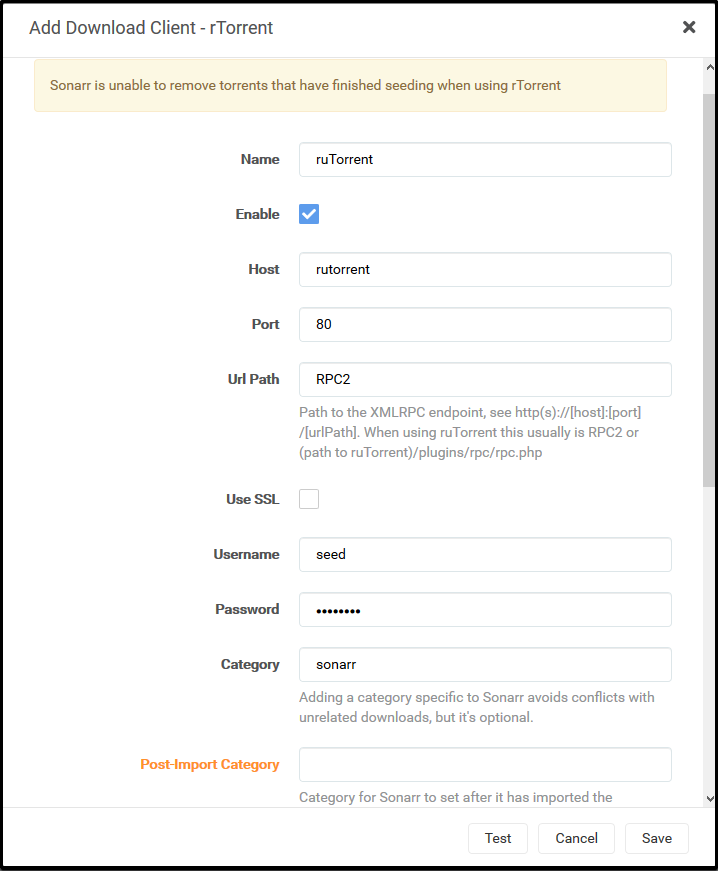
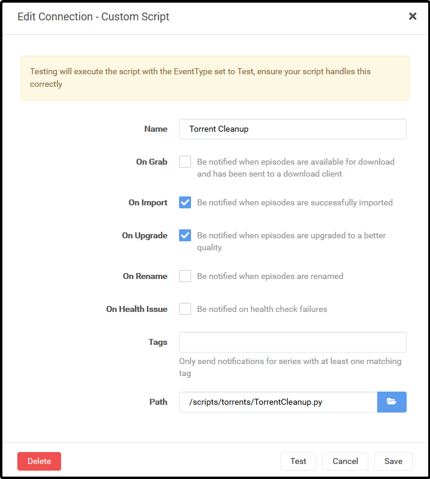
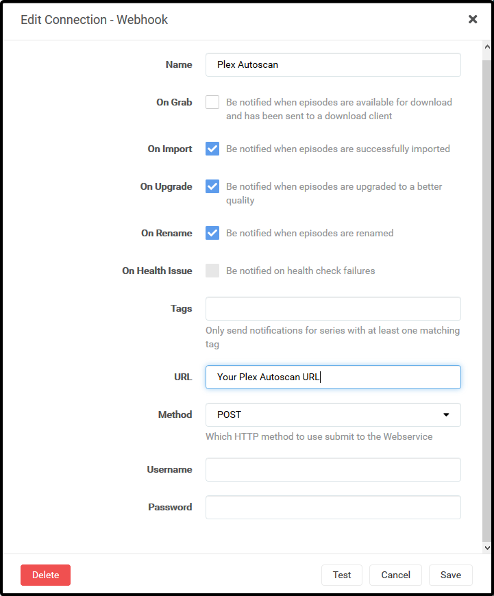

## What is it?

[Sonarr](https://sonarr.tv/) is a PVR for Usenet and BitTorrent users. It can monitor multiple RSS feeds for new episodes of your favorite shows and will grab, sort and rename them. It can also be configured to automatically upgrade the quality of files already downloaded when a better quality format becomes available.

## Project Information

- [:material-home: Sonarr ](https://sonarr.tv/){: .header-icons target=_blank rel="noopener noreferrer" }
- [:octicons-link-16: Docs](https://wiki.servarr.com/sonarr/){: .header-icons target=_blank rel="noopener noreferrer" }
- [:octicons-mark-github-16: Github:](https://github.com/Sonarr/Sonarr){: .header-icons target=_blank rel="noopener noreferrer" }
- [:material-docker: Docker: ](https://hub.docker.com/r/hotio/sonarr){: .header-icons target=_blank rel="noopener noreferrer" }

## URL

- To access Sonarr, visit https://sonarr._yourdomain.com_

## Settings

Click on "Settings" in the sidebar.  Click "Show Advanced" at the top of the Settings pane.

Make changes in the following sections:

!!! Settings

    === "Media Management"

        These settings control management of media files.

        === "Episode Naming"

            - "Rename Episodes": `Yes`

            - "Replace Illegal Characters": `Yes`

            - Set your preferred naming format; here are some examples:

                <details>
                <summary>Plex's Naming Preference</summary>

                Example: <br />
                ```
                /Gotham/Season 01/Gotham - s01e01 - Pilot.mkv
                ```

                Standard Episode Format: <br />
                ```
                {Series Title} - s{season:00}e{episode:00} - {Episode Title}
                ```

                Anime Episode Format: <br />
                ```
                {Series Title} - s{season:00}e{episode:00} - {Episode Title}
                ```

                Daily Episode Format: <br />
                ```
                {Series Title} - {Air-Date} - {Episode Title}
                ```

                Season Folder Format: <br />
                ```
                Season {season:00}
                ```

                Multi-Episode Style: <br />
                ```
                Prefixed Range
                ```

                Reference: https://support.plex.tv/articles/200220687-naming-series-season-based-tv-shows/  <br />
                </details>


                <details>
                <summary>TRaSH' naming guide</summary> <br />

                Example:  <br />
                ```
                Single Episode:

                The Series Title! (2010) - S01E01 - Episode Title 1 [AMZN WEBDL-1080p Proper][HDR][10bit][x264][DTS 5.1]-RlsGrp

                Multi Episode:

                The Series Title! (2010) - S01E01-E02-E03 - Episode Title [AMZN WEBDL-1080p Proper][HDR][10bit][x264][DTS 5.1]-RlsGrp
                ```

                Standard Episode Format: <br />
                ```
                {Series TitleYear} - S{season:00}E{episode:00} - {Episode CleanTitle} [{Preferred Words }{Quality Full}]{[MediaInfo VideoDynamicRange]}[{MediaInfo VideoBitDepth}bit]{[MediaInfo VideoCodec]}{[Mediainfo AudioCodec}{ Mediainfo AudioChannels]}{MediaInfo AudioLanguages}{-Release Group}
                ```

                for more examples and discussion see the reference: https://trash-guides.info/Sonarr/Sonarr-recommended-naming-scheme/
                </details>

        === "Folders"

            - "Create empty series folders": `No`

            - "Delete empty folders": `No`

        === "Importing"

            - "Skip Free Space Check": `No`

            - "Use Hardlinks instead of Copy": `No`

            - "Import Extra Files": `Yes` (_can be your preference_)

            - "Extra File Extensions": `srt, sub, idx`

        === "File Management"

            - "Ignore Deleted Episodes": `No` (_can be your preference_)

            - "Download Propers": `No` (_can be your preference_)

            - "Analyse video files": `No`

            - "Change File Date": `None`

            - "Recycle Bin": _blank_ (Rclone deletes are sent to Gdrive trash folder, anyway)

        === "Permissions"

            - Set Permissions: `No`

        === "Save"

            - Click "Save".
        
    === "Indexers"

        These settings control [indexers](../saltbox/prerequisites/prerequisites.md#usenet-or-bittorrent-sources) and related behavior.
        
        === "NZBHydra2"

            1. Click Add Indexer (`+`).

            2. Select "Newznab".

            3. Add the following:

                Name: NZBHydra2

                Enable RSS Sync: _Your Preference_

                Enable Search: _Your Preference_

                URL: `http://nzbhydra2:5076`

                API Key: [Your NZBHydra2 API Key](../apps/nzbhydra2.md)

                Additional Parameters: _Leave Blank_

            4. Your settings will look like this:

                

            5. Click "Save" to add NZBHydra2.

            Note: The "Test" will keep failing until you add an indexer in [NZBHydra2](../apps/nzbhydra2.md).

        === "Jackett"

            Note: Each Indexer you have defined in Jackett will need to be added separately.

            1. Click Add Indexer (`+`)

            2. Select "Torznab".

            3. Add the following:

                Name: Indexer Name

                Enable RSS Sync: _Your Preference_

                Enable Search: _Your Preference_

                URL: [Indexer's Torznab Feed](../apps/jackett.md)

                API Key: [Your Jackett API Key](../apps/jackett.md)

                Additional Parameters: _Leave Blank_

            4. Your settings will look like this:

                

            5. Click "Save" to add the indexer.


    === "Download Clients"

        These settings control downloading behavior and clients.

        === "Completed Download Handling"

            - "Enable": `Yes`

            - "Remove": `Yes` (_can be your preference_)

        === "Failed Download Handling"

            - "Redownload": `Yes`

            - "Remove": `Yes`

        === "NZBGet"

            1. Click Add (`+`)

            2. Add a new "NZBGet" download client.

            3. Add the following:

                Name: NZBGet

                Enable: `Yes`

                Host: `nzbget`

                Port: `6789`

                Username:  [Your NZBGet Username](../apps/nzbget.md)

                Password:  [Your NZBGet Password](../apps/nzbget.md)

                Category: `sonarr`

                Use SSL: `No`

                Add Paused: `No`

            4. Your settings will look like this:

                

            5. Click "Save" to add NZBGet.

        === "ruTorrent"

            1. Click Add (`+`)

            2. Add a new "rTorrent" download client.

            3. Add the following:

                Name: ruTorrent

                Enable: `Yes`

                Host: `rutorrent`

                Port: `80`

                URL Path: `RPC2`

                Use SSL: `No`

                Username: [Your ruTorrent Username](../apps/rutorrent.md)

                Password: [Your ruTorrent Password](../apps/rutorrent.md)

                Category: `sonarr`

                Directory: _Leave Blank_

            4.  Your settings will now look like this:

                

            5. Click "Save" to add ruTorrent.
    
    === "Connect"

        These settings control connections to other applications or systems.

        === "Torrent Cleanup"

            Torrent Cleanup Script is a custom script that will cleanup torrents from ruTorrent that were auto-extracted, but still being seeded. So if the script detects that `.rar` files are in the folder that Sonarr just imported from, it will delete the imported video file(s), leaving just the `.rar` files for seeding.

            1. Click "Settings" -> "Connect".

            2. Add a new "Custom Script".

            3. Add the following:

                Name: Torrent Cleanup

                On Grab: `No`

                On Download: `Yes`

                On Upgrade:  `Yes`

                On Rename:`No`

                Path: `/scripts/torrents/TorrentCleanup.py`

            4. The settings will look like this:

                

            5. Click "Save" to add the Torrent Cleanup script.


        === "Plex Autoscan"

            1. Click "Settings" -> "Connect".

            2. Add a new "Webhook".

            3. Add the following:

                Name: Plex Autoscan

                On Grab: `No`

                On Download: `Yes`

                On Upgrade:  `Yes`

                On Rename: `Yes`

                Filter Movie Tags: _Leave Blank_

                URL: [Your Plex Autoscan URL](../plex-autoscan/#obtaining-the-plex-autoscan-url)

                Method:`POST`

                Username: _Leave Blank_

                Password: _Leave Blank_

            4. The settings will look like this:

                


            5. Click "Save" to add Plex Autoscan.


    === "General"

        These settings control general aspects of Sonarr.

        === "Start-Up"

            - "Bind Address: `*`

            - "Port Number": `8989`

            - "URL Base": _blank_

            - "Enable SSL": `No` (_SSL is handled by Traefik_)

        === "Proxy Settings"

            - "Use Proxy": `No`

        === "Logging"

            - "Log Level": `Debug`

        === "Analytics"

            - "Enable": `No` (_your preference_)

        === "Updates"

            - "Branch": `main`

            - "Automatic": `Off`

        === "Save"

            - Click "Save".


## TV Path

1. When you are ready to add your first show to Sonarr, click the "Path" drop-down and select "Add a different path".

2. Click the blue "Browse" button, navigate to `/mnt/unionfs/Media/TV`, scroll to the bottom, and select "OK".

3. Click the green "check" button to add the path.

4. All TV shows added now will have that path set.


## API Key

This is used during the setup of [Overseer](overseerr.md) and [Organizr](organizr.md).

* Go to "Settings" -> "General" -> "Security" -> "API Key".
