This guide will show you how to set up a Google Project and create credentials that will work for safire or sa-gen or similar tools.

It's assuming you're working through the steps from [here](rclone-manual.md).

This guide is assuming you are using a standard GSuite Business or GSuite Workspace account.

1. Open Google APIs Console site: https://console.developers.google.com and login with your Google account.

    Click on the project or organization at the top:

    

2. Click "New Project":

    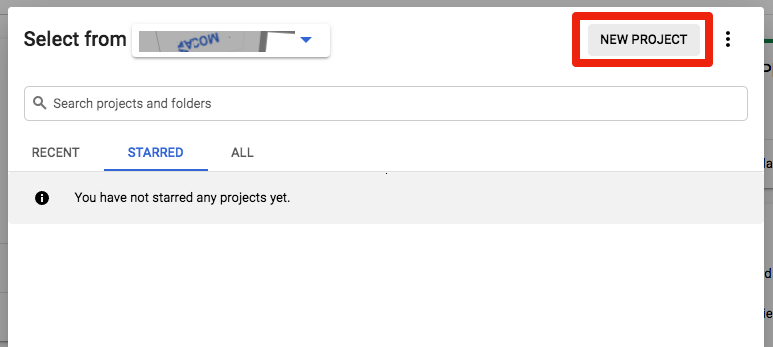

3. Name the project. Click "Create".

    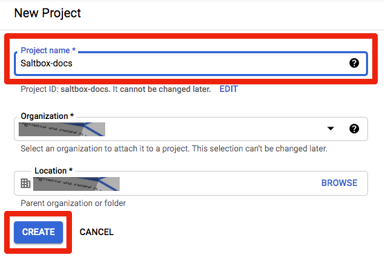

    You'll see a progress dialog, when it's complete, click "Select Project"

    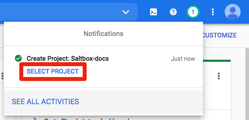
    
4. Click "Go to APIs overview".

    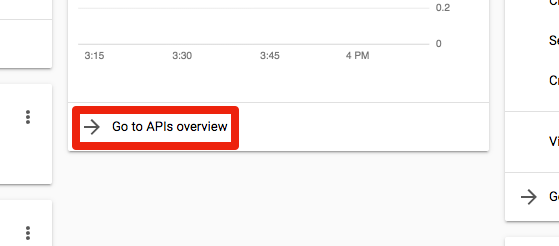

5. Click "ENABLE APIS AND SERVICES" at the top.

    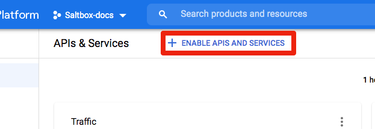

    You'll be taken to the "API Library":

    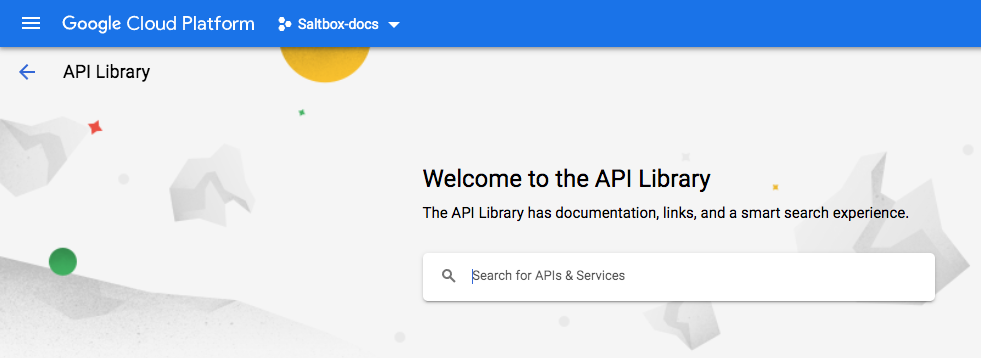

6. Search for "Admin". Click "Admin SDK API".

    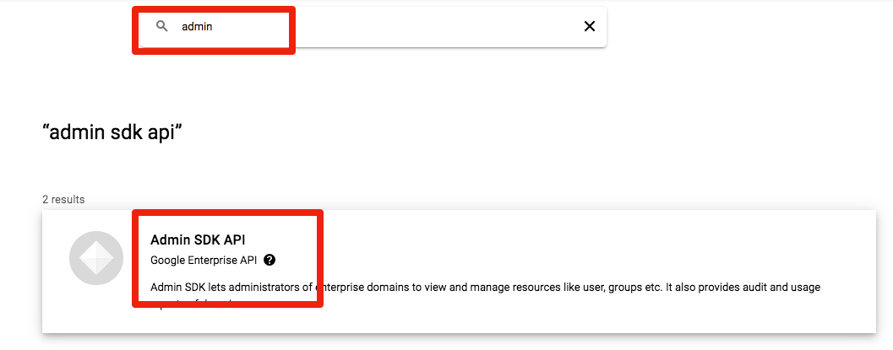

    Click the button to enable the API:

    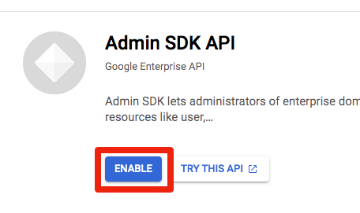

    You'll go to a API Overview page.  Click the browser back button twice:

    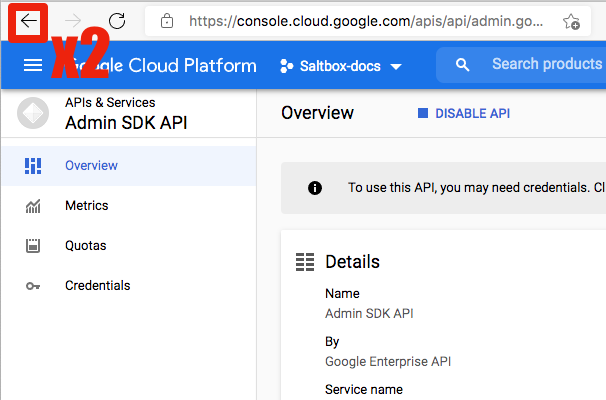

    Repeat this process for six more APIs:
    
        - Google Drive API
        - Identity and Access Management (IAM) API
        - Cloud Resource Manager API
        - Service Usage API
        - Service Management API
        - Google Sheets API

    You may find that some of these APIs have been enabled already as dependencies of others, like Service Management here:

    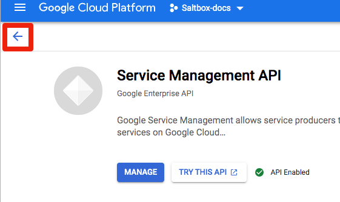
    
    In that case, click the website back arrow once and move on to the next one.

7. Now click "APIS and Services" then "Credentials" in the left column to go to the credentials dash:

    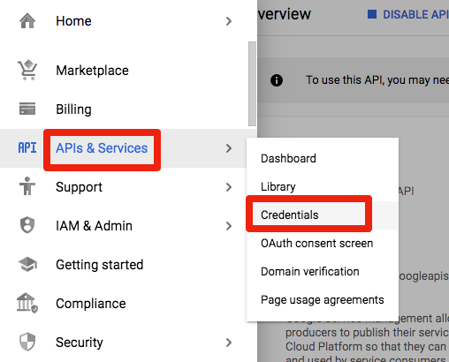

8. Click "Configure consent screen" over on the right:
   
    

9. Choose "Internal" user type and click "Create":
   
    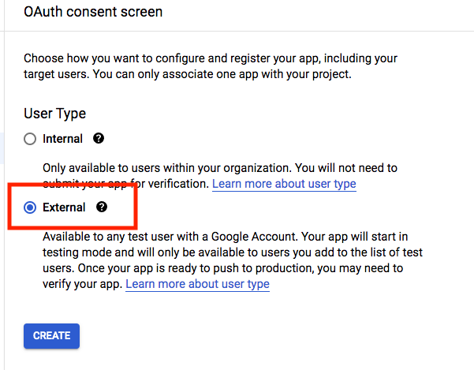

10. On this screen:
    1. type in the App Name (e.g. Rclone)
    2. Enter a "User support email"
    3. Scroll to the bottom
    4. Enter an email address under "Developer contact information"
    5. Click "SAVE AND CONTINUE".
   
    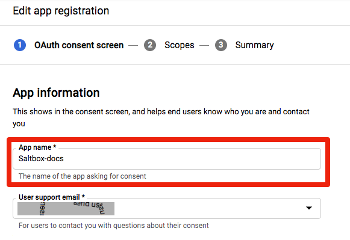

    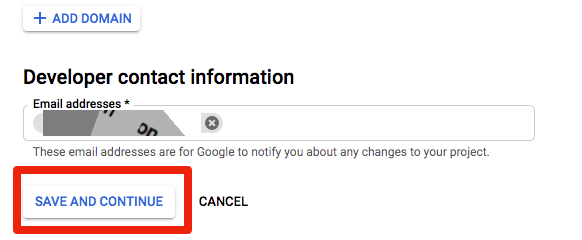

11. Click  "SAVE AND CONTINUE" on the scopes screen:
   
    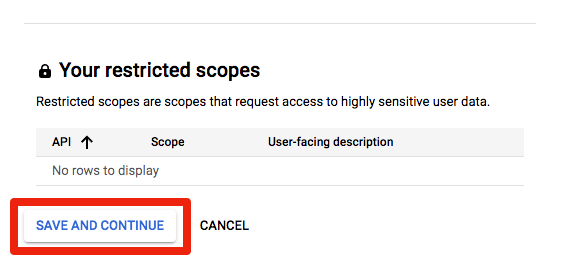

    And "BACK TO DASHBOARD" on the final summary:
   
    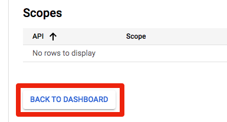

12. Click "Credentials" in the sidebar:
   
    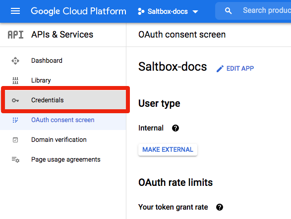

13. Click "Create Credentials", then "OAuth client ID":
   
    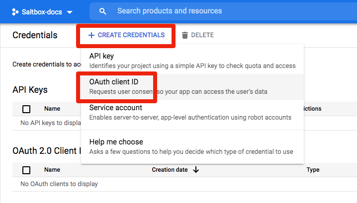

14. Choose "Desktop App", give the app a name, and click "CREATE":
   
    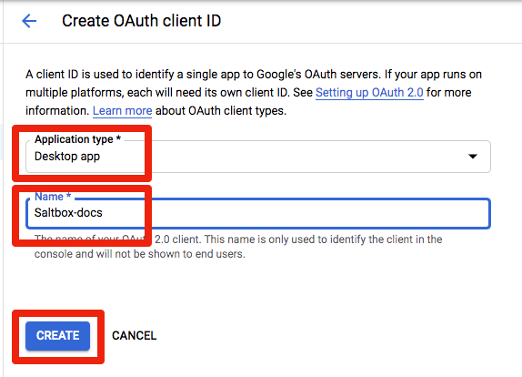

15. You'll be presented with the Client ID and Secret.  Copy and save them if you like.  Click on "DOWNLOAD JSON" to download the credential file:
   
    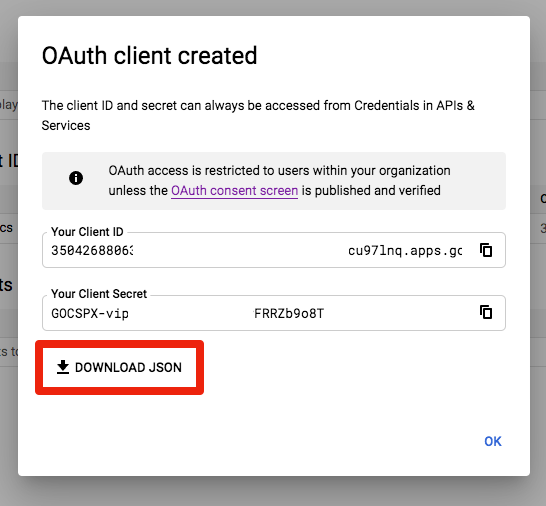
