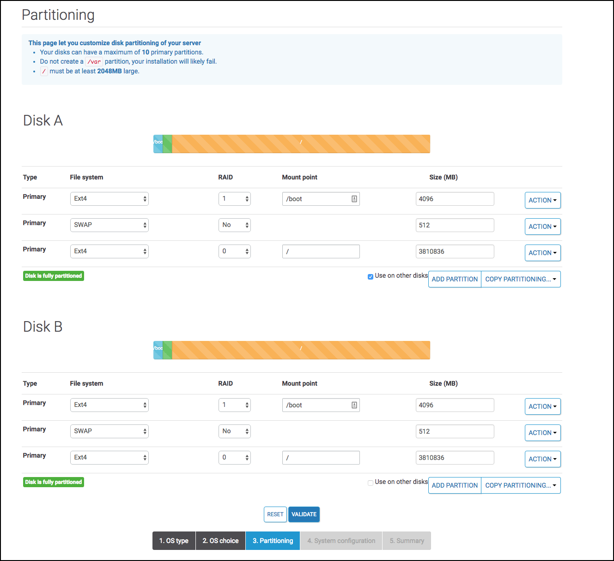
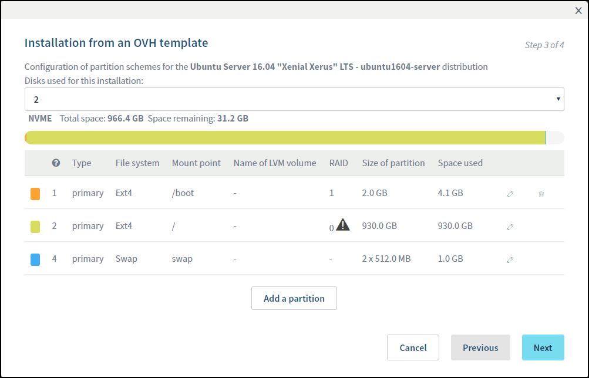
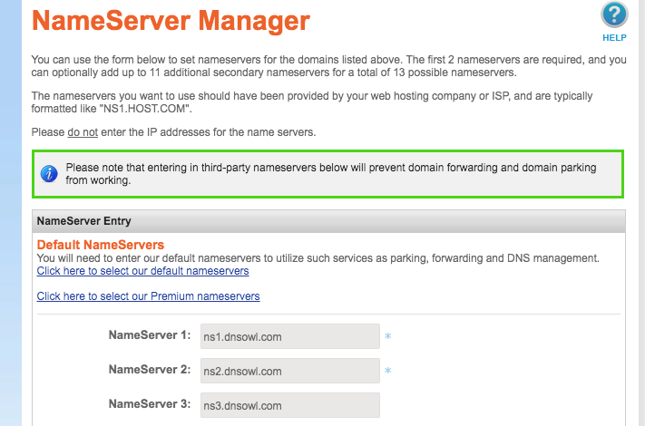
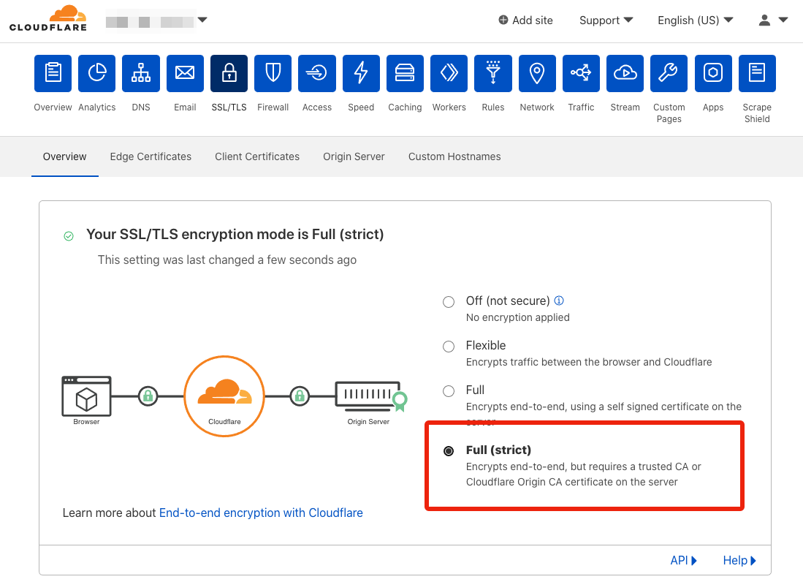
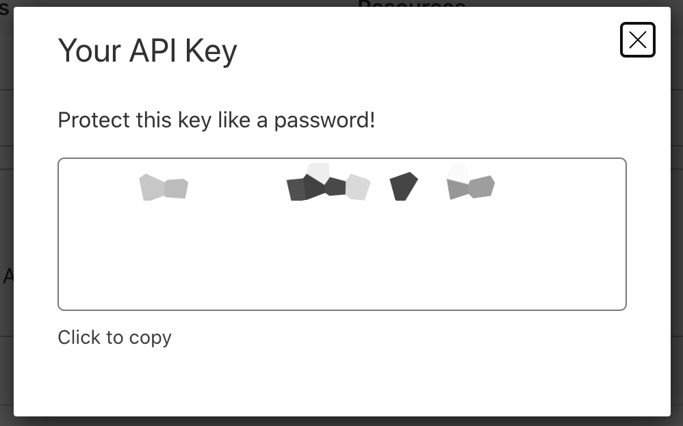
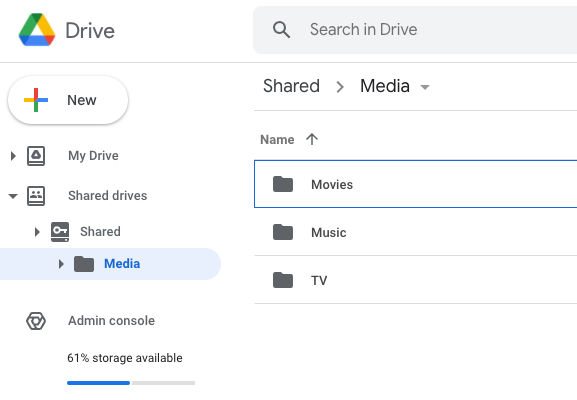

## Presumptions
Saltbox presumes you have a basic understanding of Linux, Docker containers, BitTorrent, and Usenet, and are also familiar with Sonarr, Radarr, NZBGet, rTorrent/ruTorrent, and Plex/Emby.

The Saltbox setup is all done on the command line in the linux shell.  There is no GUI and there are no plans to add one.  If you want to run Saltbox, you *will* need to be familiar with Linux.

The guides in this wiki are only meant to setup Saltbox specific settings into the various apps that are installed with Saltbox (e.g. Sonarr, Radarr, Plex, etc) and are not meant to be a full setup for, or an introduction to, the workings of these apps. However, you may pickup a few things as you go thru the guides. 

If you wish to learn more about them in detail, you can easily find a ton of guides for them online (e.g. [HTPC Guides](https://www.htpcguides.com){target=_blank}, [YouTube](https://www.youtube.com){target=_blank}, etc).

There are, broadly, 5 prerequisites to installing Saltbox:

<!-- TOC depthFrom:1 depthTo:6 withLinks:1 updateOnSave:1 orderedList:0 -->

- [A Server](#server)
- [A Domain Name](#domain-name)
- [Cloud Storage](#cloud-storage)
- [A Plex Account](#plex-or-emby-account)
- [Usenet or Bittorrent sources](#usenet-vs-bittorrent)

<!-- /TOC -->

## Server
### Getting a Server

Some points below:

- You will need a dedicated server, from a server provider (e.g. Hetzner, kimsufi, OVH, etc), installed with Ubuntu Server [20.04](https://releases.ubuntu.com/20.04/).

- Best results are seen with an actual dedicated server, not a VPS like those available from Linode, Vultr, or the like.  Linodes, Vultr "Cloud Compute", Hetzner "Cloud Servers", and probably others like them, in particular, are known to _not_ work in at least one significant way; NZBGet reports 0 available disk space while Sonarr, Radarr, and tools like `df` and `du` report disk space as expected.

- You will need root access to install Saltbox.

- Server should be a completely fresh OS install. Do not try to install any dependencies on your own, Saltbox will do that for you. 

- Saltbox only supports x64 (i.e. Intel or AMD 64) machines. ARM based hardware [such as the Raspberry Pi] is not supported.

- Get a server with at least 100GB+ of hard disk space. Even though media is uploaded to the cloud, there is still a need local storage for things like app data and backups. 

    Practically, you should have more like 500GB of space available _at a minimum_.

    Cloudplow's default folder size threshold, to upload media to the cloud, is set at 200GB. To lower that, you'll need to go [here](../../apps/cloudplow.md){target=_blank}

    If you are planning to use Usenet, SSD should be considered required, and NVME highly recommended.  Usenet is extremely disk I/O intensive.

    If you are planning to use torrents, you should have much more disk space than that available for seeding.  Your seeding torrents will not be moved to your cloud storage; they will consume local disk space as long as they are seeding. 

    If you are installing as a Feederbox/Mediabox setup rather than the all-in-one Saltbox, the disk requirements change a bit. Downloading drives disk requirements on the Feederbox [as discussed above] and primarily the Plex/Emby metadata drives the disk requirements on the Mediabox.  Depending on the size of your library, that metadata can be quite large.

-  If you are setting this up on a home server, verify, **before installing Saltbox**:
 
     1. Make sure your ISP doesn't block ports 80 and 443 [if your ISP blocks these ports, it won't work.]
     2. Make sure that your router supports hairpin NAT [if this isn't supported, you won't be able to access apps via subdomain from inside your network]
     3. Open the relevant [ports](../../reference/ports.md){target=_blank} (eg `80`, `443`, etc) in your [router](https://portforward.com/router.htm)/firewall and forward them to the IP of the box on which you want to install Saltbox, **before installing Saltbox**.
     4. Point your domain at your home IP and configure some dynamic DNS software to keep it updated.  Saltbox has a dynamic dns client available [it's not installed by default], but there are many ways to set this up.  Make sure that DNS has propagated and your domain returns your home IP via `ping` or something like it, **before installing Saltbox**.

### Tips

#### Ubuntu 20.04

- If you get an option like below, select choose `ubuntu-2004-focal-64-minimal`.

  

- Install OpenSSH server if asked. 

#### Partitioning:
- If you have multiple hard drives on the server (eg. 2 x 4 TB), put them in RAID 0 to maximize space and speed (you don't need redundancy as you can schedule backups of Saltbox).

- Set all available space to `/` (remove `/home` and `/data` partitions).

- Leave ample space in `/boot` (e.g. 2+ GB).

- putting the `/opt` directory on a `btrfs` partition can dramatically reduce the amount of time your containers are down during backup.

- Examples

     - Online.net

         

     - OVH

       

       

     - Hetzner installimage
         ``` bash
         # Hetzner Online GmbH - installimage
         #
         # This file contains the configuration used to install this
         # system via installimage script. Comments have been removed.
         #
         # More information about the installimage script and
         # automatic installations can be found in our wiki:
         #
         # http://wiki.hetzner.de/index.php/Installimage
         #
         
         DRIVE1 /dev/nvme0n1
         DRIVE2 /dev/nvme1n1
         SWRAID 1
         SWRAIDLEVEL 0
         HOSTNAME sb.domain.com
         PART /boot  ext4     512M
         PART lvm    vg0       all
         LV vg0   swap   swap      swap         8G
         LV vg0   root    /     ext4      all
         IMAGE /root/.oldroot/nfs/install/../images/Ubuntu-2004-focal-64-minimal.tar.gz
         ```

     - Hetzner installimage (with a separate 250G partition for `/opt` utilizing BTRFS for snapshot backups)

         ``` bash
         # Hetzner Online GmbH - installimage
         #
         # This file contains the configuration used to install this
         # system via installimage script. Comments have been removed.
         #
         # More information about the installimage script and
         # automatic installations can be found in our wiki:
         #
         # http://wiki.hetzner.de/index.php/Installimage
         #
         
         DRIVE1 /dev/nvme0n1
         DRIVE2 /dev/nvme1n1
         SWRAID 1
         SWRAIDLEVEL 0
         HOSTNAME sb.domain.com
         PART /boot  ext4     512M
         PART lvm    vg0       all
         LV vg0   swap   swap      swap         8G
         LV vg0   opt   /opt     btrfs         250G
         LV vg0   root    /     ext4      all
         IMAGE /root/.oldroot/nfs/install/../images/Ubuntu-2004-focal-64-minimal.tar.gz
         ```
w
## Domain Name

**You will need a domain name** as Saltbox apps are only accessed via https://appname._yourdomain.com_ (see [[Basics: Accessing Saltbox Apps]]). The steps below will help you set up a domain and DNS settings for use with Saltbox.

Ports are [for the most part] bound only to the internal `saltbox` docker network, which means they are not visible on the host; you won't be able to connect to the apps using `IP:PORT`.

# 1. Domain Provider

Get a domain name from any domain name registry (e.g. [Namecheap](https://Namecheap.com), [Godaddy](https://Godaddy.com), [Namesilo](https://Namesilo.com), etc).

If you already have one, you may skip this step.

_Note: Free domain name providers, such as [Freenom](https://www.freenom.com/), do not support wildcard DNS settings, and paid domain names can be had for less than a dollar per year (see promo deals on various sites). However, you can add them to [[Cloudflare|Prerequisites: Cloudflare]] and not have to worry about it._

If you are planning to use the automatic Cloudflare integration, there are some top-level domains [TLDs] that will not work with it.  Refer to [this page](https://support.cloudflare.com/hc/en-us/articles/360020296512-DNS-Troubleshooting-FAQ).

As of 2020/07/26:  "DNS API cannot be used for domains with .cf, .ga, .gq, .ml, or .tk TLDs."

# 2. DNS Setup

Pick one of the setups below. This will on whether you meet certain criteria, as listed under the "Notes" section.

## i. Wildcard DNS Setup

**Notes:**

 - For DNS providers that allow wildcards.

 - For [[Saltbox install type|Basics: Saltbox Install Types]].

**Steps:**


Created an A Record for your subdomains with `*` for host and set the value to your server IP address.

   | **Type** | **Host** | **Value**           | **TTL**   |
   |:-------- |:-------- |:------------------- |:--------- |
   | A Record | *        | _Server IP Address_ | 300       |


<details><summary>Example</summary>

Namecheap > Domain List > Manage > Advanced DNS > Add New Record > A Record > `*` for Host > Server IP for Value.

   

</details>

## ii. Non-Wildcard DNS Setup

**Notes:**

 - For DNS providers that do not allow wildcards (e.g. Freenom).

 - For [[Mediabox / Feederbox  install types|Basics: Saltbox Install Types]].

 - For [[Cloudflare|Prerequisites: Cloudflare]] users.

   Note: if you provide a Cloudflare email and API Key in your settings, the Saltbox installer will set this up for you automatically, provided you enter a top-level domain in the settings [i.e. `DOMAIN.TLD`, not `WHATEVER.DOMAIN.TLD`]


### Saltbox Install Type

You will need to create A Records for all Saltbox subdomains. 


  | **Type** | **Host**     | **Value**               | **TTL**   |
  |:-------- |:------------ |:----------------------- |:--------- |
  | A Record | plex         | _Saltbox IP Address_   | 300 |
  | A Record | plexpy       | _Saltbox IP Address_   | 300 |
  | A Record | plexrequests | _Saltbox IP Address_   | 300 |
  | A Record | jackett      | _Saltbox IP Address_   | 300 |
  | A Record | radarr       | _Saltbox IP Address_   | 300 |
  | A Record | sonarr       | _Saltbox IP Address_   | 300 |
  | A Record | rutorrent    | _Saltbox IP Address_   | 300 |
  | A Record | nzbget       | _Saltbox IP Address_   | 300 |
  | A Record | nzbhydra2    | _Saltbox IP Address_   | 300 |
  | A Record | organizr     | _Saltbox IP Address_   | 300 |
  | A Record | portainer    | _Saltbox IP Address_   | 300 |


### Mediabox / Feederbox Install Type

You will need to create A Records for both IP addresses (Media and Feeder boxes) and set them to their respective subdomains. 


#### Mediabox

  | **Type** | **Host**     | **Value**               | **TTL**   |
  |:-------- |:------------ |:----------------------- |:--------- |
  | A Record | plex         | _Mediabox IP Address_  | 300 |
  | A Record | plexpy       | _Mediabox IP Address_  | 300 |
  | A Record | plexrequests | _Mediabox IP Address_  | 300 |

#### Feederbox

  | **Type** | **Host**     | **Value**               | **TTL**   |
  |:-------- |:------------ |:----------------------- |:--------- |
  | A Record | jackett      | _Feederbox IP Address_ | 300 |
  | A Record | radarr       | _Feederbox IP Address_ | 300 |
  | A Record | sonarr       | _Feederbox IP Address_ | 300 |
  | A Record | rutorrent    | _Feederbox IP Address_ | 300 |
  | A Record | nzbget       | _Feederbox IP Address_ | 300 |
  | A Record | nzbhydra2    | _Feederbox IP Address_ | 300 | 
  | A Record | organizr     | _Feederbox IP Address_ | 300 |
  | A Record | portainer    | _Feederbox IP Address_ | 300 |


## Cloudflare

### Intro

[Cloudflare](https://www.cloudflare.com) a service that, among other things, protects and accelerates a wide network of websites. By being the "man in the middle", it can act like a free DNS provider.

Saltbox makes adding subdomains to Cloudflare's DNS settings a breeze via automation. All you need is the API key.

Note that there are some top-level domains [TLDs] that will not work with this automation. Refer to [this page](https://support.cloudflare.com/hc/en-us/articles/360020296512-DNS-Troubleshooting-FAQ).

As of 2020/07/26: "DNS API cannot be used for domains with .cf, .ga, .gq, .ml, or .tk TLDs."

Although Cloudflare is not required for Saltbox, it is still recommended because:

1. DNS changes propagate almost instantly (a lot faster than a domain provider's DNS service).

1. Hide your server's IP behind Cloudflare's.

1. Makes setting up Mediabox / Feederbox a lot quicker.

1. Allows for automated setup of subdomains for Saltbox add-on apps.

1. Can optionally enable CDN / Proxy for your subdomains.

1. It's free.

_Note: Saltbox does not enable CDN / Proxy by default, but you may do so yourself after installing Saltbox (see section [[below|Prerequisites: Cloudflare#post-setup]])._


### Sign Up

1. Sign up for a free [Cloudflare](https://www.cloudflare.com/) account.

1. On your Domain Registrar's website (e.g. GoDaddy, Namecheap, etc), set the Name Servers to what Cloudflare instructs you to.

   - Examples:

     - Namecheap.com -> "Dashboard" -> _your domain.ltd_ -> "Manage" -> "Name Servers" -> "Custom DNS" -> add the nameservers in.

       

     - Namesilo.com -> "Manage My Domains" -> _your domain.ltd_ -> "NameServers" -> "Change" ->  add the nameservers in.

       

### Setup

1. Go to [Cloudflare.com](https://www.cloudflare.com/).

1. Here you will see that your domain will have an "Active" status. Click on your domain to continue.

   

1. Click the **SSL/TLS** tab.

1. Set **SSL** to `Full (strict)`.

   

<!-- Temporarily commented out - may not be needed..

1. Set **Always Use HTTPS** to `off`.

1. Set **HTTP Strict Transport Security (HSTS)** to `disabled`.

   

-->

### Cloudflare API Key

1. Go to [Cloudflare.com](https://www.cloudflare.com/).

1. Click the **Overview** tab.

1. Click **Get your API token**.

   { width=60% }

1. Under **API Keys** and then **Global API Key** click **View**.

   { width=60% }

1. On the login popup, type in your **password** and click **View**.

   { width=50% }

1. Save your API key.

   { width=50% }

### Post-Setup

After Saltbox has added in the subdomains, you may go back in and turn on CDN for for them if you like.  NOte, however, that enabling proxying on your plex or emby subdomains [or more generally proxying large amounts of non-HTML content] is against Cloudflare TOS and may end up getting your Cloudflare account banned.

Do this AFTER all your certs have been assigned and you have confirmed that all the Saltbox app sites are loading OK. 

This also applies to any app/subdomains you add in the future - wait till after you get certs before enabling CDN.

_Note 1: Leave the subdomains `saltbox`, `mediabox`, and `feederbox` as `DNS Only`, as they were created to reach your servers directly and not behind a CDN proxy (i.e. they need to resolve to the server's IP and not Cloudflare's)._

_Note 2: If you enable proxying on plex/emby subdomains despite it being against TOS, you may find that performance suffers badly._

You can do this by:

1. Going to [Cloudflare.com](https://www.cloudflare.com/).

2. Clicking the **DNS** tab.

3. Find the subdomain of interest.

4. Under "Status", click the switch next to the gray cloud icon (i.e. `DNS Only`) to switch to an orange one (i.e. `DNS and HTTP proxy (CDN)`).

   { width=60% }

# Cloud Storage
## Provider

Saltbox can be set up to use any cloud storage provider that [Rclone](https://rclone.org/) supports. However, Google Drive via [G-Suite Business](https://gsuite.google.com/pricing.html) is the popular choice among users.  Some of the components are designed expressly for Google Drive, like the Google Drive monitoring in plex-autoscan and the service-account rotation in cloudplow.

It is advised that you do NOT use a educational GSuite account or any GSuite account you may buy on the secondary market [eBay and the like], unless you are aware of and planning for the likelihood that it disappears one day.

## Basics

Out of the box, Saltbox stores the media unencrypted in cloud storage utilizing an Rclone VFS mount to access it. If you prefer your data is stored encrypted, you will need to do some tweaking to the Rclone config.

Media will be stored in `Movies` and `TV` folders, all within a `Media` folder in root (i.e. `/Media`). <a href="#note1" id="note1ref"><sup>[1]</sup></a>  

## Setup

```
Media
├── Movies
├── Music
└── TV
```

- Example from Google Drive:

  

If you have media in other folders, you can simply move them into these folders via the Cloud Storage Provider's web site.

Note 1: For Google Drive, you can use the [Shift-Z trick](https://www.labnol.org/internet/add-files-multiple-drive-folders/28715/) to "symlink" folders here. 

Note 2: All the paths/folders mentioned here, and elsewhere, are **CASE SENSITIVE** (see  [[Saltbox Paths|Basics: Saltbox Paths]]).

---
 <sub> <a id="note1" href="#note1ref"><sup>1</sup></a> If you would like to customize your Plex libraries beyond what is listed above, see [[Customizing Plex Libraries]].</sub>

# Plex or Emby Account

You'll need a [Plex](https://www.plex.tv) account.

Sign up for a free Plex account at https://www.plex.tv/sign-up/, if you don't already have one. 

It's easiest if you have a Plex account *even if you're not planning to use Plex*.  The default `saltbox` install assumes that you are using Plex, and without a Plex account in the settings, it will fail in various ways as it tries to install Plex and then things that depend on Plex.  This can be worked around<sup name="a1">[\[1\]](#f1) </sup>, and may change in the future, but for now the simplest route is to sign up for that free account, and then disable Plex after install if you don't want to use it.

<sup><b name="f1">[1](#a1)</b> Basically, run the `core` tag instead of the `saltbox` tag, then run the tags for the apps you want individually. </sup>

You can use [Emby](https://emby.media/) in lieu of Plex [admonitions above about needing a Plex accoutn for install still apply].

Sign up for a free Emby Connect account at https://emby.media/connect.html, if you don't already have one.

You'll need to install Emby manually after the initial install is complete.

# Usenet vs Bittorrent

To use Saltbox, there are requirements dependings on which method[s] you choose to download your media. It can either be [Usenet, Torrents, or both](https://www.htpcguides.com/comparing-usenet-vs-torrents/).

## i. Usenet

If you plan on using [Usenet](https://www.reddit.com/r/usenet/wiki/faq#wiki_usenet_faq) (i.e. Newsgroups) with Saltbox, you'll need 2 things: a [Usenet provider](https://www.reddit.com/r/usenet/wiki/providers) and a [Usenet indexer](https://www.reddit.com/r/usenet/wiki/indexers). We recommend you have multiple indexers (and even multiple providers) to better your chances of finding/downloading media.

## ii. BitTorrent

If you plan on using torrents with Saltbox, we recommend you have access to a [private torrent tracker](https://www.reddit.com/r/trackers/wiki/getting_into_private_trackers) as most servers don't allow public ones. However, if you still want to use public torrent trackers with Saltbox, you are free to do so.  You will need to make some changes to the configuration to allow access to public trackers, as they are blocked by default.
